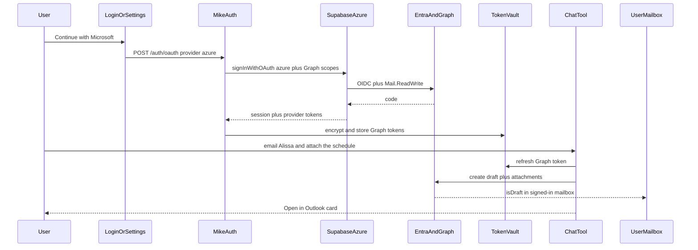

# Microsoft login and Outlook draft staging

**Status: approved design, not implemented.** Cloud agents should implement this
spec in this repository. Do not apply the new migration to production, do not
deploy Railway or Vercel, and do not change `UPLOAD_PROCESSING_MAX_RUNNING_PER_USER`
or the dirty filer tree, until Yule confirms.

Any user who grants mail access can stage review-only Outlook drafts in their
own mailbox, attach Mike documents, and join a live conversation by searching
their Outlook (Message-ID first, then subject and participants). The Attune
filer stays the matter-sync executor; it is not the mail path.

## Implementation checklist

- [ ] Document and wire Entra app + Supabase Azure provider + `MICROSOFT_OAUTH_*` env (admin consent, identity linking)
- [ ] Add `azure` to `POST /oauth`, Microsoft login/signup button, Word handoff, Settings connect/link/disconnect
- [ ] Migration + encrypted `user_microsoft_tokens` vault with Graph refresh and deny-all RLS
- [ ] `create_outlook_draft` tool, SSE events, Open in Outlook / Connect cards, prompt rules
- [ ] Attach authorised Mike docs via Graph; persist `email_internet_message_id`; reply via mailbox search (Message-ID, then subject and participants)
- [ ] Auth/vault/tool/UI tests and this document kept current

## Context

Mike currently has email/password, Google OAuth, and optional SAML SSO
([`docs/deployment.md`](../deployment.md)). Google is identity-only. SAML Entra
SSO is also identity-only and does **not** grant Graph. Staging a draft in the
signed-in lawyer's Drafts needs a delegated Microsoft token, so Microsoft login
must request those scopes at sign-in (and again later via "Connect Microsoft"
for existing accounts).

This is tenant-generic, not `libris-colleague`-only. First production
enablement is Libris Colleague after Attune admin-consents the Entra app.

## Product rules

- Drafts only. Request `Mail.ReadWrite`, never `Mail.Send`. Do not call Graph `/send`.
- The workflow is for every user who logs in with Microsoft (or later connects it) and grants mail access, on any Mike deployment that has Azure OAuth enabled. It is not Attune-only.
- The draft always lands in the signed-in user's mailbox (`/me/messages`). Mike must not accept a `mailbox` override.
- Join a live Outlook conversation when Mike can resolve one message in that mailbox. Prefer Message-ID from a filed email; otherwise search by normalised subject and the other party's address. Ambiguous results stay a new draft.
- Existing SAML "Continue with SSO" stays. It remains identity-only.
- The filer Graph app stays for Zoho/SharePoint matter sync. Do not enqueue `outlook.createDraft` from Mike.
- Graph create-draft does not apply the user's Outlook signature. End the body at "Kind regards,". A stored house signature can come later.
- This deliberately holds **per-user delegated tokens** (encrypted) on Railway. That is a different trust model from the sync ADR, which keeps the **app-only** Graph identity on the filer.

## 1. Entra app and Supabase Azure provider (operator setup)

Register a new Entra app (not the filer daemon `6608f7e8-…`). Suggested name: Libris Colleague / Mike. Accounts in any organisational directory so OSS and Attune both work.

Delegated Graph permissions:

- `openid`, `profile`, `email`, `offline_access`
- `User.Read`
- `Mail.ReadWrite`

Redirect URI is the Supabase Auth callback (`https://<project>.supabase.co/auth/v1/callback`), same pattern as Google. Enable the Azure provider in the Libris Colleague Supabase Auth dashboard with that client id/secret. Grant **admin consent** in the Attune tenant for `Mail.ReadWrite`.

Enable automatic identity linking on matching email in GoTrue so `yule@attune.legal` (already a password/Google user) does not get a second Mike account. Document this in [`docs/deployment.md`](../deployment.md) next to the SAML section.

Mike env (new):

- `MICROSOFT_OAUTH_ENABLED=true` (backend; fail closed if unset)
- `MICROSOFT_OAUTH_CLIENT_ID` and `MICROSOFT_OAUTH_CLIENT_SECRET` matching the Supabase Azure provider, so Mike can refresh Graph tokens after the Supabase session no longer carries `provider_refresh_token`

Supabase owns the Entra app registration. Mike stores the **user's** Graph tokens after exchange, then refreshes them with the same client credentials.

## 2. Microsoft as a login type

Mirror Google. Do not invent a second OAuth stack.

- [`backend/src/modules/auth/auth.service.ts`](../../backend/src/modules/auth/auth.service.ts): `startMicrosoftOAuth` via `signInWithOAuth({ provider: "azure", options: { redirectTo, skipBrowserRedirect: true, scopes: "openid profile email offline_access User.Read Mail.ReadWrite" } })`.
- [`backend/src/modules/auth/auth.routes.ts`](../../backend/src/modules/auth/auth.routes.ts): accept `provider: "azure"` on `POST /oauth`. Reject when `MICROSOFT_OAUTH_ENABLED` is not true. After `exchangeCodeForSession`, persist `session.provider_token` and `session.provider_refresh_token` (available only at exchange).
- Logged-in reconnect: `POST /auth/oauth` with `{ provider: "azure", intent: "link" }` using `linkIdentity` so existing sessions can add Microsoft without signing out.
- [`frontend/src/app/lib/authApi.ts`](../../frontend/src/app/lib/authApi.ts), new `MicrosoftAuthButton` beside [`GoogleAuthButton.tsx`](../../frontend/src/app/components/auth/GoogleAuthButton.tsx), login and signup pages, Word add-in dialog (same handoff ticket path as Google).
- Shared Microsoft mark next to [`frontend/src/shared/ui/GoogleIconUI.tsx`](../../frontend/src/shared/ui/GoogleIconUI.tsx).
- Settings → Security: Connected / Connect / Disconnect Microsoft. Disconnect deletes the vault row and unlinks the Azure identity. Password and MFA stay as they are.
- Extend `publicAuthUser` with `microsoftConnected` (identity present **and** a live vault row). Do not treat `app_metadata.provider === "azure"` as enough: a SAML or stale identity is not a Graph grant.

## 3. Token vault

New table `user_microsoft_tokens` (user_id PK, encrypted access + refresh, expiry, granted scopes, mailbox UPN). Deny-all RLS, service_role only, same pattern as MCP connector tokens. Update `backend/schema.sql` in the same change.

Encrypt with the existing AES-GCM helper in [`backend/src/lib/mcp/client.ts`](../../backend/src/lib/mcp/client.ts) (`USER_API_KEYS_ENCRYPTION_SECRET`), using a distinct scrypt salt so a leak of MCP ciphertext is not reusable here.

Module: `backend/src/modules/integrations/microsoftGraph.service.ts` (or `microsoftAuth` + `outlookDraft` topic files behind the integrations facade). Responsibilities:

- persist/rotate tokens
- refresh against `https://login.microsoftonline.com/common/oauth2/v2.0/token` using the same Entra client as Supabase
- `getGraphAccessToken(userId)` for tools
- Graph helpers: create draft, add attachments, create reply, resolve message by `internetMessageId`, mailbox search by subject and participant

If refresh fails with `invalid_grant`, delete the vault row and return a structured `outlook_auth_required` result. Never surface Graph error text.

## 4. Chat tool: `create_outlook_draft`

Follow the AU-research tool pattern (schema → streaming gate → dispatcher → SSE → card).

Schema in [`toolSchemas.ts`](../../backend/src/modules/chat/engine/tools/toolSchemas.ts): `to`, `cc`, `bcc`, `subject`, `html_body`, `attachment_doc_ids` (chat-local `doc-N` slugs), optional `reply_to_doc_id` (an email document already in the chat/project), optional `in_reply_to_internet_message_id` when the model already has a Message-ID from a read email.

Advertise the tool when Microsoft OAuth is enabled. If the user has no live token, the tool still exists and returns `outlook_auth_required` so the UI can show Connect Microsoft instead of the model claiming it cannot email.

Implementation in [`toolDispatcher.ts`](../../backend/src/modules/chat/engine/tools/toolDispatcher.ts):

1. Resolve a Graph token or emit the connect event.
2. Authorise each `attachment_doc_id` the same way `read_document` does (chat registration or project access). Load bytes from R2 via existing version `storage_path`.
3. `POST /me/messages` with `isDraft` implied (Graph create is a draft until `/send`).
4. Attach files: simple JSON under ~3 MB, upload session above. Cap 25 files / 140 MB each (Graph message limit).
5. Reply path, in this order:
   1. If `reply_to_doc_id` or `in_reply_to_internet_message_id` is set, resolve a Message-ID and `GET /me/messages?$filter=internetMessageId eq '…'` (well-formed quoted id).
   2. If that misses, or the user asked to continue a live thread without a filed `.eml`/`.msg`, search the signed-in mailbox with Graph `$search` on the normalised subject (strip `Re:`/`Fw:`/`Fwd:`) plus the other party's address from `to`/`cc`. Prefer the newest message in a matching `conversationId`.
   3. On a single clear match, `POST /me/messages/{id}/createReply` and PATCH body, recipients, and attachments so the draft stays on that `conversationId` with the quoted original.
   4. If zero matches, or two or more conversations look equally plausible, create a **new** draft and say so on the card. Do not invent threading and do not show an inbox picker.
6. Emit `outlook_draft_created` with `web_link`, `subject`, `to`, attachment names, and `threaded: true|false`. Prompt the model not to paste the Outlook URL in prose (same rule as `doc_created`).

New prompt rules in [`prompts.ts`](../../backend/src/modules/chat/engine/prompts.ts): when the user asks to email someone, call the tool; never say the mail was sent; end the body at "Kind regards,"; attach the real files.

Wire type in [`packages/contracts/index.d.ts`](../../packages/contracts/index.d.ts). Card in [`EventBlocks.tsx`](../../frontend/src/app/components/assistant/message/EventBlocks.tsx): subject, recipients, attachment list, "Open in Outlook" (`webLink`). Connect card for `outlook_auth_required`.

## 5. Reply-draft data: persist `internetMessageId`, then search Outlook

[`documents`](../../backend/migrations/20260921_04_document_email_meta.sql) currently has subject/from/to/received_at only. Add nullable `email_internet_message_id`. Parse `Message-ID` in [`emailMessage.ts`](../../backend/src/lib/emailMessage.ts) on `.eml`/`.msg` ingest (and from SharePoint list items when the filer already sends it). A filed Message-ID is the best join key; mailbox search is the fallback so a live thread can be joined even when that email was never stored in Mike.

Prompt the model to treat "reply to Alissa on that chain" as a threaded draft: pass `reply_to_doc_id` when a chat/project email exists, otherwise pass the other party and the stripped subject and let mailbox search resolve it.

No inbox picker in this slice. Ambiguous search results become a new draft with `threaded: false` on the card.

## 6. Tests and docs

- Auth: Microsoft start/link/disabled, exchange persists tokens, link does not create a second user (mocked GoTrue).
- Vault: encrypt/decrypt, refresh, invalid_grant clears the row.
- Tool: draft success, missing token → connect event, unauthorised doc id rejected, attachment size cap, reply by Message-ID, mailbox subject/participant search hit, ambiguous or empty search → new draft with `threaded: false`.
- Frontend: login/signup button, security row, draft card, connect card.
- Keep this document current. Add a deployment subsection for Entra + Supabase Azure + identity linking to [`docs/deployment.md`](../deployment.md) and `backend/.env.example`.

Verification while iterating: targeted Vitest as above. After UI lands, exercise login → Connect → chat "draft an email to X and attach this document" in the browser.

## Out of scope

- Sending mail, even to `@attune.legal`.
- Staging into someone else's Drafts.
- Using the filer command queue for these drafts.
- Replacing SAML SSO.
- Outlook signature injection, `updateDraft` / `deleteDraft`, inbox picker UI (mailbox search is in scope; choosing among several threads is not).
- Changing `UPLOAD_PROCESSING_MAX_RUNNING_PER_USER` or the dirty filer tree.
