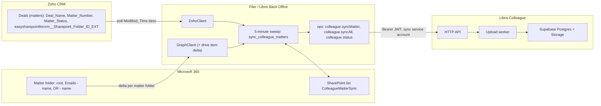

# Integration: SharePoint / Zoho matter sync into Libris Colleague

**Status: approved design, implementation not started.** The executor is the Attune
email filer / Libris Back Office (Azure Functions app `attuneemailfiler-flex`), not this
repository. This document records what this deployment ("Libris Colleague", the
`libris-colleague` profile of this fork) must expose and what the filer will do with it.
The filer-side specification is `SPEC-colleague-matter-sync.md` in the
`sharepoint-email-filer` repository; the governance decision is Libris ADR 0005.

This is Attune Legal-specific planning, not general OSS guidance, which is why it lives
under `docs/integrations/` rather than beside the generic setup docs. See
`config/README.md` for the deployment-profile layer that keeps the OSS tree clean.

## Decisions

Recorded 2026-09-20 (Yule Guttenbeil):

1. **Boundary exception.** Libris Colleague is a deliberate exception to the Libris
   Microsoft-native containment rule. It runs outside the Microsoft organisation (Vercel,
   Railway, Supabase in Sydney) on infrastructure assessed as secure to the standard of
   any SaaS service the firm uses. Matter documents may be copied into it.
2. **Executor.** The sync runs inside the filer as new named command-queue ops plus a
   runner on its existing 5-minute sweep. No Microsoft Graph or Zoho credentials are held
   on Railway, and no sync code goes into this repository's `backend/`. The filer already
   holds the Graph identity, the Zoho OAuth client, the command queue and the
   folder-readiness poll the sync needs.
3. **Scope.** Every open Zoho matter is mirrored: existing matters are backfilled and new
   matters are created automatically, so the documents are processed before a lawyer
   first opens the matter here. Matters are owned by a sync service account inside an
   Attune Legal organisation in Libris Colleague, so staff share them through the normal
   organisation access model.
4. **Source of truth.** Zoho holds the matter record and the authoritative link to the
   matter's SharePoint folder. Folder resolution is always a Zoho lookup, never a
   SharePoint-side search.
5. **Push direction.** Writing back to SharePoint stays an explicit, user-triggered action
   guarded by an ETag check (signed off earlier). It is outside phase 1; only its hook
   point is noted below.

Earlier open questions are answered in "Open questions, answered".

## Deployment context

Three objectives share this codebase, in priority order:

1. Evaluate the app (done; see `TESTING.md`).
2. Use it in Attune Legal's practice, connected to SharePoint and Zoho. This is the
   current priority and what this document plans for.
3. A separate, customer-facing mode.law instance later, as another deployment of this
   repo with the `mode-law` profile and its own Supabase project.

Objective 2 is its own deployment: Vercel project `libris-colleague`, Railway service
`mike`, Supabase project "Libris Colleague" (Postgres, Auth and Storage through its S3
endpoint). Nothing here is folded into any mode.law project.

## Systems involved

Once those files are ready, Colleague schedules a `memory.matter_brief` job
for the project. That pass reads the latest email thread and writes the
"Where the matter sits" block into project memory so chat does not have to
rebuild the picture from the full library. See [Scoped memory](../memory.md).

## What the filer already has (verified 2026-09-20)

These facts replace the secondhand notes this document previously carried. Paths are in
the `sharepoint-email-filer` repository.

- **Named ops, no passthrough.** `src/ops.py` registers handlers in `OP_HANDLERS` with
  the signature `(params, confirm, ctx: OpContext) -> dict`; `execute()` rejects any op
  not registered. Commands are idempotent by `id` (a result file in `done/` or `failed/`
  means the command is skipped, never re-run; `src/command_queue.py`). Ops are enqueued
  through the MCP tool `enqueue_command`, `POST /api/enqueue` (function key), or the
  pending-folder sweep.
- **The 5-minute sweep.** `file_matter_emails` in `function_app.py` runs `run_all()`
  under the `filer-run` blob lease; `_run_all_locked()` already chains Zoho routing sync
  (`sync_from_zoho`), pending matter filings, email filing, the command queue and the
  categoriser. A sync runner slots into that chain behind an `AppAdminSettings` toggle,
  the same way `FILING_ENABLED` and `COMMAND_QUEUE_ENABLED` work (`src/app_config.py`).
- **Zoho matter lookup.** `src/zoho_client.py` defines
  `FOLDER_FIELD = "easysharepointforcrm__Sharepoint_Folder_ID_EXT"` whose value is
  `driveId|||itemId`, and a default field set of `id, Deal_Name, Matter_Number,
  Description, FOLDER_FIELD, Old_SharePoint_Link, Matter_Status`. Deals are found by id,
  by `Matter_Number` search, or paged by `Modified_Time` descending.
- **Folder readiness.** `zoho.createMatter` creates the Deal with `trigger: ["workflow"]`
  so Easy SharePoint provisions the folder asynchronously (5 to 10 minutes). The
  `PendingMatterFilings` list (`src/pending_matter_filing.py`) polls each sweep until the
  folder id lands, with a 2-hour timeout. The sync reuses that pattern for new matters.
- **Graph.** App-only through the Function's user-assigned managed identity with
  `Sites.ReadWrite.All`. `src/graph_client.py` has listing (`list_child_folders`,
  `list_children_by_path`), `download_item_content`, uploads, `copy_item`, `rename_item`,
  `ensure_child_folder`, and `resolve_matter_subfolder` for the `Emails -` and `DR -`
  children. It has **no drive delta helper**; one is added by the spec.
- **Emails on disk.** The filer saves each message as MIME `.eml` named
  `<subject>__<YYYYMMDD_HHMMSS>.eml` and saves each non-inline attachment as a separate
  file named `<stamp> - <original name>` in the same `Emails -` folder (`src/filer.py`).
- **Not present.** No Zoho webhook receiver for Deal creation (discovery is by polling),
  no `mcp.call` executor (registry only), no `Matter_Source` handling, and no code that
  talks to Mike or Libris Colleague today.

## Background flow

1. **Discovery.** Each sweep pages open Deals (`Matter_Status = Open`) by `Modified_Time`
   descending, so new and recently active matters are seen first. A Deal without a folder
   id is queued and retried until Easy SharePoint lands it (2-hour timeout, same as
   `PendingMatterFilings`).
2. **Matter creation.** For a Deal with no sync row, the filer calls `POST /projects` with
   `name = Deal_Name`, `cm_number = Matter_Number` and the Attune Legal `org_id`, and
   records the returned project id on the sync row. A `cm_number` lookup through
   `GET /projects` is the fallback if the row is missing.
3. **Folder mirror.** The matter root, `Emails - <name>`, `DR - <name>` and any nested
   folders map to Libris Colleague folders through
   `POST /projects/:projectId/folder-paths/resolve` with `conflict_resolution: "reuse"`
   (the same RPC-backed path the folder upload uses in the web app).
4. **Document ingest.** A Graph delta query on the matter folder returns only changed
   items since the stored `deltaLink`. New files go through `POST /upload-sessions`
   (`purpose: document_create`, `destination: { scope: "project", project_id, folder_id }`,
   at most 50 files per session), a presigned `PUT` per file to Supabase Storage, the
   per-file `complete` call, then polling the session. A modified file becomes a new
   version (`purpose: document_version_create`). Moves and renames use
   `PATCH /projects/:projectId/documents/:documentId/folder` and
   `PATCH /projects/:projectId/documents/:documentId`. Deletions in SharePoint are recorded
   on the sync row and not mirrored in phase 1.
5. **Email rule.** Inside an `Emails -` folder only `.eml` files are uploaded. Libris
   Colleague renders the message to PDF and files each attachment as its own document from
   the message itself (`backend/src/modules/uploads/uploads.expand.ts`), so the filer's
   separately saved `<stamp> - attachment` copies are skipped to avoid every attachment
   appearing twice. Outside `Emails -` folders every supported type uploads: PDF, Word,
   Excel, PowerPoint, `.eml`, `.msg`, `.zip`.
6. **Budget.** Each sweep has a cap on files and wall time so a backfill spreads across
   many sweeps without starving filing; newest matters first. Railway converts in the
   background. Readiness before a lawyer arrives is the goal, not instant completion.
7. **Identity.** A Supabase user `colleague-sync@attune.legal` belongs to the Attune Legal
   organisation as an admin. The filer obtains a JWT with the GoTrue password grant using
   the project's publishable key, caches it, and sends `Authorization: Bearer` on every
   call. `requireAuth` accepts bearer tokens (`backend/src/middleware/auth.ts`); upstream
   marks that path as a compatibility path, so this fork keeps it deliberately.
8. **State and observability.** The SharePoint list `ColleagueMatterSync` (one row per
   Deal) holds project id, drive and folder ids, `deltaLink`, timestamps, status and last
   error. The Back Office console gains a page for it, and repeated failures notify
   `backoffice@attune.legal`.

## API contract this deployment provides

Existing endpoints the filer will call, all behind `requireAuth`:

| Purpose | Endpoint |
| --- | --- |
| Create or find the matter | `POST /projects`, `GET /projects` (filter by `cm_number`) |
| Mirror folders | `POST /projects/:projectId/folder-paths/resolve` |
| List what is already here | `GET /projects/:projectId/documents` |
| Upload new files and versions | `POST /upload-sessions`, `POST /upload-sessions/:id/urls`, `POST /upload-sessions/:id/files/:fileId/complete`, `GET /upload-sessions/:id` |
| Move, rename | `PATCH /projects/:projectId/documents/:documentId/folder`, `PATCH /projects/:projectId/documents/:documentId` |
| Organisation membership | `/orgs/:orgId/members`, `/orgs/:orgId/invitations` |

Limits that apply to the service account and need raising for backfill:
`RATE_LIMIT_UPLOAD_SESSION_CREATE_MAX_PER_HOUR` (default 50 sessions an hour, so 2,500
files) and the general limiter (`RATE_LIMIT_GENERAL_*`). Both are environment variables
on the Railway service (`backend/.env.example`).

## Changes required in this fork (additive)

1. **Migration**: `document_versions.source` gains `sharepoint_sync`; `documents` gains
   nullable `external_provider`, `external_item_id`, `external_ctag`, `external_web_url`
   so the filer can reconcile what is already here and the UI can link back to SharePoint.
   `schema.sql` and the Compose replay follow the migration rules in `AGENTS.md`.
2. **Upload manifest**: an optional per-file `external` block (`provider`, `item_id`,
   `ctag`, `web_url`) validated in `uploads.manifest.ts`, stored by the worker, and
   returned by `GET /projects/:projectId/documents`.
3. **Rate limits**: environment overrides for the service account as above.
4. **Bearer auth**: keep the `Authorization: Bearer` path in `requireAuth` for API clients.
5. **UI (optional)**: a "Synced from SharePoint" label with the SharePoint link on
   documents; the matter list already shows the matter number (`cm_number`).

Nothing else changes in this repository. The adapter is a client of the existing API,
which is exactly the pattern `API_BOUNDARY.md` sets out for external callers.

## Storage

Supabase Storage through its S3 endpoint is the bucket for this deployment
(`R2_ENDPOINT_URL=https://<ref>.storage.supabase.co/storage/v1/s3`,
`R2_REGION=ap-southeast-2`; the variable names are legacy from R2 and the client is
generic S3). Synced files write through the same `uploadFile` and `storageKey` helpers as
manual uploads. Revisit only if egress cost becomes material.

## Auth and credentials

- Graph: the filer's existing user-assigned managed identity. `Sites.Selected` would be
  tighter than `Sites.ReadWrite.All`; that is a filer decision and does not change this
  design.
- Zoho: the filer's existing Self Client refresh token (`ZOHO_*` settings).
- Libris Colleague: the service account credentials live only in the Function's app
  settings (`COLLEAGUE_SYNC_EMAIL`, `COLLEAGUE_SYNC_PASSWORD`, `COLLEAGUE_API_BASE`,
  `COLLEAGUE_SUPABASE_URL`, `COLLEAGUE_SUPABASE_PUBLISHABLE_KEY`), added to the console's
  secret allowlist. Nothing about the filer is stored in this repository or on Railway.
- Access inside Libris Colleague follows the organisation model: the service account
  creates matters in the Attune Legal organisation; staff see them through membership. Per
  matter restrictions, if ever needed, use the existing `project_access_grants` and
  organisation overrides rather than a second identity.

## Push direction (later phase)

When a user accepts an AI edit or generates a document, a "Save to SharePoint" action will
call a filer op (working name `colleague.pushDocument`) with the document id and the
SharePoint item to update. The op re-reads the item's ETag, refuses if it moved since the
last sync, and otherwise uploads a new SharePoint version. This hook is documented here so
the phase 1 build leaves room for it (the `external_*` columns above are what it needs);
it is not built in phase 1.

## Open questions, answered

1. **App-only or delegated Graph auth.** App-only, through the filer's managed identity.
   Matter access inside Libris Colleague is governed by the organisation model, not by
   each person's SharePoint permissions.
2. **Schema shape.** As listed under "Changes required in this fork".
3. **Coordination with the filer.** Resolved by reading the code: the filer becomes the
   executor. The relayed concern that document work should stay Microsoft-native applies
   to the Back Office executor pipeline; Yule has decided that Libris Colleague is an
   approved exception (ADR 0005).

## Deferred to implementation planning

Railway sizing for backfill (plan, Singapore region, a separate worker service), the exact
per-sweep budget, and whether a SharePoint deletion should eventually archive the document
in Libris Colleague.

## Related

- `API_BOUNDARY.md`: this integration is the first concrete external caller of the API.
- `config/README.md`: the deployment profile that brands this deployment.
- `docs/deployment.md`: upload limits and the email and zip expansion behaviour.
- `sharepoint-email-filer/SPEC-colleague-matter-sync.md`: the executor specification.
- Libris `docs/decisions/0005-libris-colleague-sync-exception.md`: the governance record.
